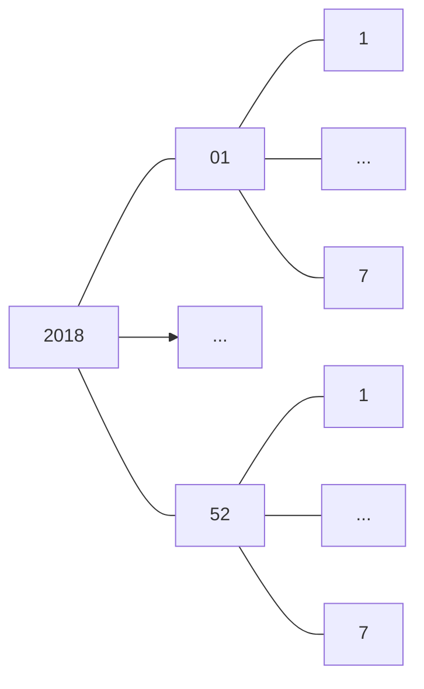
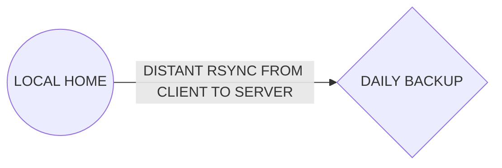
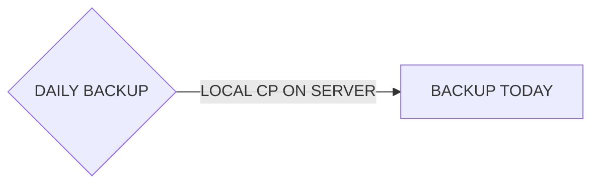

# SafeSync

## Introduction

SafeSync is an automatic incremental backup tool used to synchronize a client
folder with a server Backup folder everyday. It uses hard symbolic links in
order to use minimum storage.

## How it works

Firstly, everyday, the client's folder is synchronized on the server `DailyBackup`
folder using `rsync`. The useful power of rsync is that it only synchronises
modified files (not the whole folder each time) and that it keeps symbolic links
inside the synchronised folder.

Then, on the server side, we also have a big backup folder
containing all versions (every day) of the client's folder. This big backup folder
uses this structure:



Everday, we create hard symbolic links of every item inside the folder used
the previous day to the current day folder. We use a daily cron to do this.

Then, after making all hard links, we copy the content of daily backup folder,
WHILE keeping hard links of unchanged files. This is the point of SafeSync server
backup. We don't want two copies of the same file. The `cp` options are:

`--remove-destination` and `-u`

The folder structure is used with multiple years and we added additional (unuseful)
folders for leap years as we want at least 366 years. This is not bad as we use
date to create a path to currentDay each time we need to do a backup. Date never
returns impossible dates.

The previous process can be represented by:

1. RSYNC LOCAL HOME ON DAILY BACKUP SERVER FOLDER

2. CREATE A HARD LINK OF PREVIOUS DAY BACKUP FOLDER IN CURRENT DAY BACKUP FOLDER

3. RSYNC DAILY BACKUP FOLDER INTO CURRENT DAY BACKUP FOLDER


## Tools used on Server

- `RSYNC`: A utility (open source) for efficiently transferring and synchronizing files
  across computer systems, by checking the timestamp and size of files.
- `SSH`: Secure Socket Shell, network protocol that provides administrators with a
  secure way to access a remote computer.
- `CRON`: The software utility cron is a time-based job scheduler in Unix-like computer
  operating systems.
- `HARD LINKS`: A hard link is merely an additional name for an existing file on Linux or
  other Unix-like operating systems: `cp -al`.

## Installation of tools

1. Server side

   - `su -`
   - Update your apt package repository cache: `apt-get udpdate`
   - Install rsync: `apt-get install rsync`
   - Install SSH server package: `apt-get install openssh-server`
     OpenSSH should be installed
   - The default behavior for OpenSSH server is that it starts automatically
     as soon as it is installed. Check if OpenSSH is running with:
     `systemctl status ssh`
     You should see ‘active (running)’ status as shown in the screenshot below.
     Which means SSH server is running.  It is also listening on port 22.
   - If in any case OpenSSH server is not running, you can run the following
     command to start OpenSSH server: `systemctl start ssh`
   - Install rsync: `apt-get install cron`
   - Update your apt package repository cache: `apt-get udpdate`

2. Client side

Debian based distros:

   - `su -`
   - `apt-get udpdate`
   - `apt-get install rsync`
   - `apt-get install ssh`

Mac OS X

As root:
- `brew tap homebrew/dupes`
- `brew install rsync`
- `brew install openssh`
- `systemsetup -setremotelogin on`

Windows

As Administrator
- Follow these steps: https://www.bleepingcomputer.com/news/microsoft/heres-how-to-enable-the-built-in-windows-10-openssh-client/
- Install cwRsync at: https://itefix.net/content/cwrsync-free-edition
and follow instructions at: https://itefix.net/content/cwrsync-installationusage

## Configuration Steps

### Server Side

1. Create directory structure on server

### Create file: safesync.cron

- `nano /etc/cron.daily/safesync.cron`

```
#! /bin/bash
BACKUP=/home/user/BACKUP # You have to edit this path
DAILY_BACKUP=/home/user/DAILY_BACKUP

YEAR=$(date +"%Y")
NB_WEEKS=52
NB_DAYS=7

if [ ! -d ${BACKUP} ]; then
mkdir -p "$BACKUP"
fi

if [ ! -d ${DAILY_BACKUP} ]; then
mkdir -p "$DAILY_BACKUP"
fi

if [ ! -d ${BACKUP}/${YEAR} ]; then
  mkdir ${BACKUP}/${YEAR}
  cd ${BACKUP}/${YEAR}
  for numWeek in `seq -w 1 ${NB_WEEKS}`; do mkdir Week${numWeek}; cd Week${numWeek}; for numDay in `seq 1 ${NB_DAYS}`; do mkdir Day${numDay}; done; cd ..; done; mkdir Week53; cd Week53; mkdir Day1;
fi

if [ $(date --date "31 December ${YEAR}" +"%U") == 53 ]; then
  mkdir Day2
fi

yesterdayDate=`date +%Y/Week%V/Day%u -d "yesterday"`
currentDate=`date +%Y/Week%V/Day%u`
cp -al ${BACKUP}/${yesterdayDate}/ /${BACKUP}/${currentDate}/
cp --remove-destination -u ${DAILY_BACKUP}/${yesterdayDate}/* ${BACKUP}/${currentDate}`
```

- `chmod u+x /etc/cron.daily/safesync.cron`

- `nano /etc/crontab`

You should see something like this:

```
*/15 * * * * test -x /usr/sbin/run-crons && /usr/sbin/run-crons
0 * * * * rm -f /var/spool/cron/lastrun/cron.hourly
0 5 * * * rm -f /var/spool/cron/lastrun/cron.daily
0 4 * * 1 rm -f /var/spool/cron/lastrun/cron.weekly
```
If not add it so that information about previous executions of cronjobs are saved
in the folder /var/spool/cron/lastrun.
That is important because you can avoid lauching a cronjob before the end of the previous one.

We also need to add this in order to change the parameters of cron.daily folder:
```
0 3 * * * rm -f /etc/cron.daily/safesync.cron
```

This will run our safesync.cron everyday at 3 AM.

The final /etc/crontab should look about like this:

```
SHELL=/bin/sh
PATH=/usr/local/sbin:/usr/local/bin:/sbin:/bin:/usr/sbin:/usr/bin

*/15 * * * * test -x /usr/sbin/run-crons && /usr/sbin/run-crons
0 * * * * rm -f /var/spool/cron/lastrun/cron.hourly
0 5 * * * rm -f /var/spool/cron/lastrun/cron.daily
0 4 * * 1 rm -f /var/spool/cron/lastrun/cron.weekly
0 3 * * * rm -f /etc/cron.daily/safesync.cron
```

#### Explanation

Firstly, we make a hard link of all yesterday backup files to the current day
backup folder.
Then, We want to copy daily backup files in today backup folder without removing
hard links of unchanged files and updating changed ones.

To do that, we use:
`cp --remove-destination -u dbackup/* backup/2/`
Where `--remove-destination` is for:
--remove-destination
              remove  each existing destination file before attempting to open
              it (contrast with --force)

And `-u` is for:
-u, --update
              copy only when the SOURCE file is  newer  than  the  destination
              file or when the destination file is missing

You dont have to run this:

#### A simple example

- Create a test folder: `mkdir Test`
- Move inside this folder: `cd Test/`
- Create a daily backup folder: `mkdir dbackup`
- Create a backup folder: `mkdir backup`
- Create a day 1 folder inside backup folder: `mkdir backup/1`
- Create a day 2 folder inside backup folder: `mkdir backup/2`
- Create a.txt in daily backup folder containing "1": `echo 1 > dbackup/a.txt`
- Create b.txt in daily backup folder containing "2":`echo 2 > dbackup/b.txt`
- Copy daily backup content inside day 1 folder: `cp dbackup/* backup/1/`
- Create all symbolic links of items inside day 1 folder
  to day 2 folder:`cp -al backup/1/* backup/2/`
- Print the whole content structure: `ls -alR`

Output:
```
.:
total 16
drwxrwxr-x  4 luka luka 4096 May 12 15:21 .
drwxr-xr-x 28 luka luka 4096 May 12 15:20 ..
drwxrwxr-x  4 luka luka 4096 May 12 15:21 backup
drwxrwxr-x  2 luka luka 4096 May 12 15:21 dbackup

./backup:
total 16
drwxrwxr-x 4 luka luka 4096 May 12 15:21 .
drwxrwxr-x 4 luka luka 4096 May 12 15:21 ..
drwxrwxr-x 2 luka luka 4096 May 12 15:21 1
drwxrwxr-x 2 luka luka 4096 May 12 15:21 2

./backup/1:
total 16
drwxrwxr-x 2 luka luka 4096 May 12 15:21 .
drwxrwxr-x 4 luka luka 4096 May 12 15:21 ..
-rw-rw-r-- 2 luka luka    2 May 12 15:21 a.txt
-rw-rw-r-- 2 luka luka    2 May 12 15:21 b.txt

./backup/2:
total 16
drwxrwxr-x 2 luka luka 4096 May 12 15:21 .
drwxrwxr-x 4 luka luka 4096 May 12 15:21 ..
-rw-rw-r-- 2 luka luka    2 May 12 15:21 a.txt
-rw-rw-r-- 2 luka luka    2 May 12 15:21 b.txt

./dbackup:
total 16
drwxrwxr-x 2 luka luka 4096 May 12 15:21 .
drwxrwxr-x 4 luka luka 4096 May 12 15:21 ..
-rw-rw-r-- 1 luka luka    2 May 12 15:21 a.txt
-rw-rw-r-- 1 luka luka    2 May 12 15:21 b.txt
```

We can see 2 locations for a.txt and b.txt inside backup folder

- Update a.txt in daily backup folder `touch dbackup/a.txt`
  => cp -u works with timestamps and doesn't compare the two files
     if they have the same name
- Copy daily backup updated content (with touch) into day 2 folder:
  `cp --remove-destination -u dbackup/* backup/2/`
- Print again the whole content structure: `ls -alR`

Output:

```
.:
total 16
drwxrwxr-x  4 luka luka 4096 May 12 15:21 .
drwxr-xr-x 28 luka luka 4096 May 12 15:20 ..
drwxrwxr-x  4 luka luka 4096 May 12 15:21 backup
drwxrwxr-x  2 luka luka 4096 May 12 15:21 dbackup

./backup:
total 16
drwxrwxr-x 4 luka luka 4096 May 12 15:21 .
drwxrwxr-x 4 luka luka 4096 May 12 15:21 ..
drwxrwxr-x 2 luka luka 4096 May 12 15:21 1
drwxrwxr-x 2 luka luka 4096 May 12 15:22 2

./backup/1:
total 16
drwxrwxr-x 2 luka luka 4096 May 12 15:21 .
drwxrwxr-x 4 luka luka 4096 May 12 15:21 ..
-rw-rw-r-- 1 luka luka    2 May 12 15:21 a.txt
-rw-rw-r-- 2 luka luka    2 May 12 15:21 b.txt

./backup/2:
total 16
drwxrwxr-x 2 luka luka 4096 May 12 15:22 .
drwxrwxr-x 4 luka luka 4096 May 12 15:21 ..
-rw-rw-r-- 1 luka luka    2 May 12 15:22 a.txt
-rw-rw-r-- 2 luka luka    2 May 12 15:21 b.txt

./dbackup:
total 16
drwxrwxr-x 2 luka luka 4096 May 12 15:21 .
drwxrwxr-x 4 luka luka 4096 May 12 15:21 ..
-rw-rw-r-- 1 luka luka    2 May 12 15:22 a.txt
-rw-rw-r-- 1 luka luka    2 May 12 15:21 b.txt
```
Now, we still have 2 locations for b.txt because it wasn't updated.
In the other hand, we only have 1 location for a.txt as we used touch to update
it so that it is more recent then a.txt before copying and we need to make a new
version out of it without keeping the hard link.

- We can print the content of a.txt: `cat backup/2/a.txt`

Output:
`1`

- We can print the content of b.txt: `cat backup/2/b.txt`

Output:
`2`

### Client Side

#### Linux clients

1. Create the client backup's folder

You can either choose an existing one (even home) but make sure you have enough
memory on the server to store your whole home dir at least three times.

You can also create a backup folder inside home with `mkdir /home/Backup`

From now on, you will need to place all the data you want to backup inside the
folder you chose.

2. Create backup.cron file in /usr/sbin

- `nano /usr/sbin/backup.cron`

Write this code in the file and REPLACE the capital words :
- USER: client username (/home/user/)
- NAME_OF_DIR_YOU_CHOSE: See step above
- USER AND HOSTNAME: Used to ssh on your server
- PATH_TO_SERVER_DAILY_BACKUP_FOLDER: See server side steps: `DAILY_BACKUP=/home/user/DAILY_BACKUP`

```
date > /home/USER/rsync.log
rsync -e ssh -av --delete --hard-links --progress "/home/NAME_OF_DIR_YOU_CHOSE/"#SAMELINE
USER@HOSTNAME:./PATH_TO_SERVER_DAILY_BACKUP_FOLDER/ >> rsync.log
```

!You need to use only one line combining the two last (starts with rsync and finishes with rsync.log)!
If you don't know your server's ip address, you can get it with: `ifconfig | grep inet`
or if it doesn't work: `ip a`

Make the file executable with:

- `chmod u+x /usr/sbin/backup.cron`

From now on, whenever we need to a backup (in this case everyday), we need to call this command:
`/usr/sbin/backup.cron`

In order to have automatic backup, you need to run these commands:

- `apt-get install cron`
- `update-rc.d cron defaults`
- `/etc/init.d/fcron start`
- `crontab -e`
- `0 4 * * * /usr/sbin/sauvegardes.cron`

If you're using gentoo, use these commands:

```
# su user
# emerge fcron
# rc-update add fcron default
# /etc/init.d/fcron start
# gpasswd -a user1 cron
# crontab -e
# 0 4 * * * /usr/sbin/sauvegardes.cron
```

We still need to do one last thing! If you have look in backup.cron you'll see
that the password is not specified. That means we would need to enter it each time
the backup.cron is called (everyday with our configuration).

Therefore, we need to use public / private keys of ssh with:

```
# ssh root@IP_ADDRESS
# rm -r ~/.ssh/
# mkdir ~/.ssh
# chmod 700 ~/.ssh
# touch ~/.ssh/authorized_keys
# logout
# ssh-keygen -t rsa
# cat ~/.ssh/id_rsa.pub | ssh root@IP_ADDRESS 'cat - >> ~/.ssh/authorized_keys'
# ssh root@IP_ADDRESS
# chmod 600 ~/.ssh/authorized_keys
# chmod go-w ~/.ssh/
# reboot
# Type Ctrl-c
# rm ~/.ssh/id_rsa.pub
# ssh root@IP_ADDRESS
```

2. Install software

#### Windows clients

- Create a backup folder inside `C:/`
- Create the file backup.bat inside the folder: `C:\Program Files\cwRsync\bin`
with the following content:

```
@echo off
set PATH=C:/PATH_TO_CSWRSYNC_BIN
date /T >>rsync.log
time /T >>rsync.log
rsync -e ssh -av --delete --progress "/cygdrive/c/Sauvegardes/"#SAMELINE
USER@HOSTNAME:./PATH_TO_SERVER_DAILY_BACKUP_FOLDER/ >> rsync.log
echo TERMINE
```

Write this code in the file and REPLACE the capital words :
- PATH_TO_CSWRSYNC_BIN: Path to cwrsync.exe file
- USER: client username (/home/user/)
- NAME_OF_DIR_YOU_CHOSE: See step above
- USER AND HOSTNAME: Used to ssh on your server
- PATH_TO_SERVER_DAILY_BACKUP_FOLDER: See server side steps: `DAILY_BACKUP=/home/user/DAILY_BACKUP`

!You need to use only one line combining the two last (starts with rsync and finishes with rsync.log)!

If you don't know your server's ip address, you can get it with: `ifconfig | grep inet`
or if it doesn't work: `ip a`

In order to have automatic backup, you have to create a task:

- Open: Windows menu / Search / Task Plannifier
- Create a task that runs everyday at 3PM and executes backup.bat (inside C:/)

Follow Linux CLients procedure about private and public SSH keys.

#### Mac clients

...

### Access Saved files

#### Linux Clients

You can use `sftp` or `scp` to access files on your server. The easiest way is
to use Konqueror by typing this address in your web browser:

```
sftp://user@hostname
```
